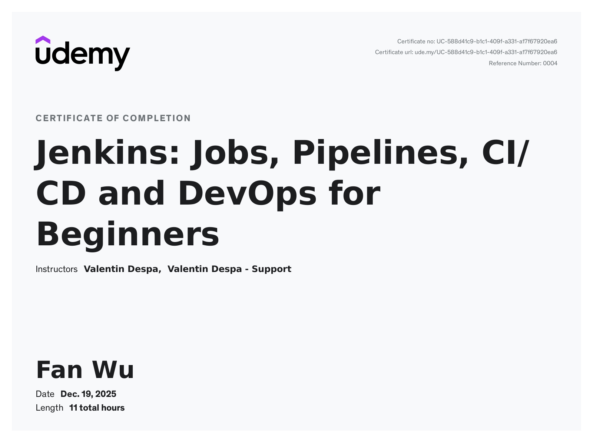

# Jenkins CI/CD Pipeline with AWS ECS Deployment

This repository demonstrates a complete CI/CD pipeline built with **Jenkins Pipeline as Code**, Docker, and AWS.

The pipeline builds a simple web application, creates and pushes Docker images to Amazon ECR, and deploys them to Amazon ECS using automated task definition revisions.

The implementation follows a hands-on learning project and includes several real-world improvements and fixes beyond the original course material.

---

## What This Pipeline Does

1. **Build**
   - Install dependencies
   - Build the application

2. **Docker Image Build**
   - Build a **multi-architecture Docker image** (ARM64 + AMD64)
   - Push the image to Amazon ECR

3. **Deploy**
   - Register a new ECS task definition revision
   - Update ECS service
   - Wait for the service to become stable

---

## Tech Stack

- Jenkins (Pipeline as Code)
- Docker & Docker Buildx
- Git & GitHub
- AWS CLI
- Amazon ECR
- Amazon ECS (Fargate)
- jq

---

## Key Improvements Beyond the Course

- Fixed ECS deployment rollback caused by **ARM vs AMD64 architecture mismatch**
- Implemented **multi-architecture Docker builds** using Buildx in Jenkins
- Removed sed command to avoid changing version-controlled file directly
- Dynamically injected image URIs during deployment using `jq`

Detailed explanations of these changes are available in [`NOTES.md`](./NOTES.md).

---

## Certificate

